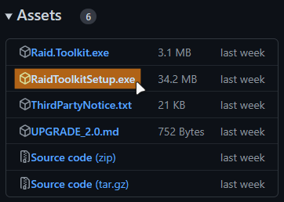

{: .note }

> Before installing, please make sure your system meets minimum requirements. You must be running an authentic & current build of Windows 10 or Windows 11, or the application may not function on your system!

To get started using Raid Toolkit, download the latest public release from the `raid-toolkit-sdk` github releases page:

[Latest Release](https://github.com/raid-toolkit/raid-toolkit-sdk/releases/latest)
{: .btn .btn-purple }

From that page, download `RaidToolkitSetup.exe` and run it.

{: .warning }

> You may receive a warning that `RaidToolkitSetup.exe` is not trusted. You must trust it and keep the file in order to install Raid Toolkit. For more information, please see [Security Notice - Code Signing](./security.md#code-signing)

