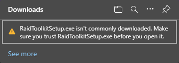
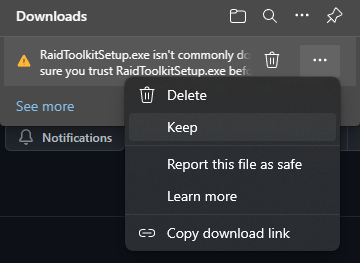
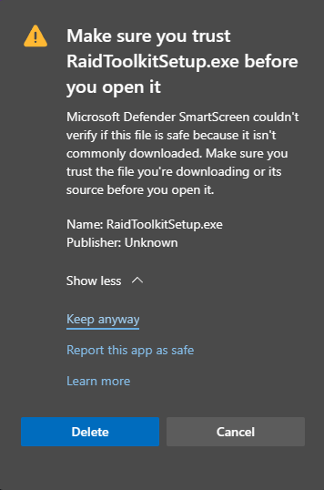

# Code Signing

{: .info }

> [Code signing](https://en.wikipedia.org/wiki/Code_signing) is a method that is used to verify that an application hasn't been altered and also contains information about the entity responsible for signing the software. This provides an extra level of security, and both Windows and various browsers such as Chrome or Edge will try to warn you any time you try to download an application which does not bear such a signature, which looks something like this:
>
> 

**Raid Toolkit is currently not a "signed application"**.  This is largely because getting a code signing certificate is both expensive ($500+ USD!) and also time consuming. In the mean time, you'll have to trust the developer(s) of this tool.

{: .note }

> While RTK is not signed, there's a few things that github provides to give you ease of mind. On the [releases](https://github.com/raid-toolkit/raid-toolkit-sdk/releases) section, there will be a small green "verified" icon next to the commit hash for a particular build. This little icon indicates that the changes came through proper channels (e.g. a pull request) and with a verified identity. It isn't perfect, we know, but it does help to ensure that the builds posted on github are always built from source and never uploaded through other means- so the full source code of the application you're about to run is just a click away.

## Bypassing Signing Warnings

If you encounter browser warnings and are comfortable continuing, follow these steps to keep and run the RTK installer:

1. Click the **`...`** menu button in the warning and select **`Keep`**

    

2. Expand **`Show More`** and then select **`Keep anyway`** again

    

After performing these steps, you will then be able to open the downloaded installer file and proceed with installation!