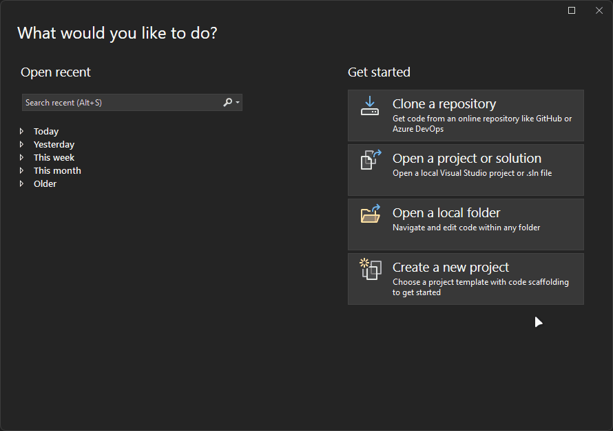

# Using the Visual Studio project template (recommended)

Before getting started, you'll need the **Raid Toolkit Extension Template** for Visual Studio. We recommend the latest version of VS2022.

## Installing the project template

Download the latest extension project template for Visual Studio:

[Download Raid Toolkit Extension Template](https://github.com/raid-toolkit/extension-template/releases/latest){:.btn .btn-purple target="_blank"}

Once you have downloaded it, double-click the downloaded `RTKExtensionTemplate.vsix` file and follow the installation prompts to install the template.

## Creating a new extension project

In Visual Studio, Create a new project and select the `Raid Toolkit Extension Project` from the list of available templates and give your project a meaningful name.

    

