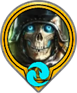
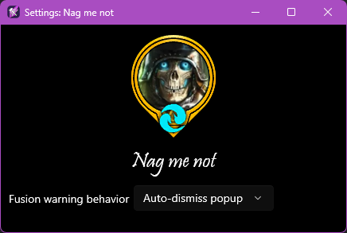

 

# Nag me not!

This extension will automatically dismiss fusion warning dialogs for persistent fusions (non-event based) in tavern when you have already completed the fusion once. No more will Diabolist be the thorn in your foot when feeding champs!

[Download Nag me not!](/download/rtkx/NagMeNot.rtkx){: .btn .btn-purple}

## Usage

To enable *Nag me not*, right-click on the Raid Toolkit icon in your system tray and choose `Extensions > Nag me not`. From there, you can change the behavior to automatically dismiss fusion warnings!

